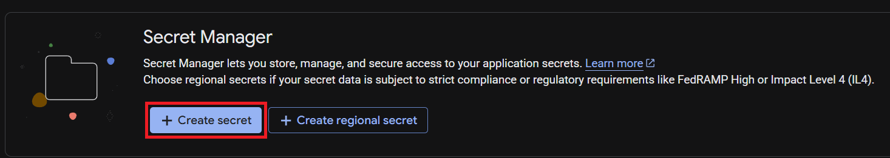

# Guide: Build on Google Cloud Secret Manager

## Pattern_1: Console

### 1. IAM
If you don't have permission to access Secret Manager, grant a role to your signed-in principal.
- Open IAM → click your principal to edit
  
  
- Click `+ Add another role`
  
  
- Select `Secret Manager Admin` (or a least-privileged equivalent) and save
  
  
- Done

### 2. Secret Manager
- Enable the Secret Manager API if disabled
  
  
- Click `+ Create secret`
  
  
- Enter `Name` and `Secret value` (example: `my-secret-name`, `ThisIsASensitiveSecret`)
  
  
- Done


## Pattern_2: Terraform

### 1. Prepare a GCS bucket for tfstate

Create a bucket once (outside Terraform) to store Terraform state.
- Console → Storage → Buckets → `+ Create`
  
  - Name: `this-is-ricky-rehivo-s-sample-gcs-bucket` (example) # FIXME: CAUTION: GCS bucket name is GLOBALLY unique. Use original name with your name.
  - Location: `us-east1`
  - Default storage class: `Standard`
  - Access control: `Uniform`
  - Protection: defaults (no retention, Google-managed encryption)

Note: You typically do NOT manage your backend bucket in the same Terraform config that uses it. If you insist on managing it, do so in a separate “bootstrap” workspace and import the existing bucket before planning (see Optional: Import existing bucket below).

### 2. Create Terraform files

Directory tree
```
your_project_dir/
  main.tf
  variables.tf
```

`variables.tf`
```hcl
variable "project_id" {
  type = string
}
```

`main.tf`
```hcl
terraform {
  required_version = ">= 1.5.0"
  required_providers {
    google = {
      source  = "hashicorp/google"
      version = "~> 5.0"
    }
  }
  backend "gcs" {
    bucket = "this-is-ricky-rehivo-s-sample-gcs-bucket"   # FIXME: change to your bucket
    prefix = "terraform/state/noctivault-quickstart"
  }
}

provider "google" {
  project = var.project_id
  region  = "us-east1"
}

# Secret Manager configuration
resource "google_secret_manager_secret" "secret" {
  project   = var.project_id
  secret_id = "my-secret-name"

  replication {
    auto {}
  }

  lifecycle {
    prevent_destroy = false # set true to prevent accidental deletion
  }
}

resource "google_secret_manager_secret_version" "secret_version" {
  secret      = google_secret_manager_secret.secret.id
  secret_data = "ThisIsASensitiveSecret"
}
```

Optional: Import existing tfstate bucket (if you choose to manage it)

Add this resource to a separate “bootstrap” config or workspace:

```hcl
resource "google_storage_bucket" "tfstate_bucket" {
  project  = var.project_id
  name     = "this-is-ricky-rehivo-s-sample-gcs-bucket"  # FIXME: change to your bucket
  location = "us-east1"

  storage_class                   = "STANDARD"
  uniform_bucket_level_access     = true
  force_destroy                   = false
}
```

Then import it into Terraform state before planning/applying:

```bash
terraform import google_storage_bucket.tfstate_bucket this-is-ricky-rehivo-s-sample-gcs-bucket
```

### 3. Apply

```bash
cd your_project_dir
terraform init
terraform plan   # Inspect carefully
terraform apply  # Type "yes" when prompted
```
